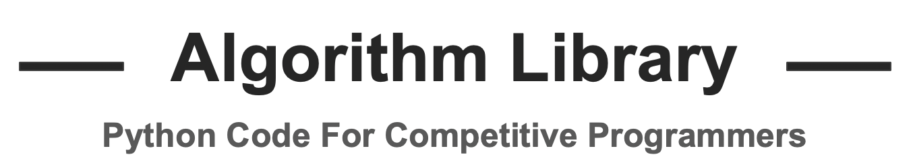

## Algorithm Library  
In competitive programming, there are frequently used algorithms．  
In this repository contains sample code for such algorithms. 

## Table of Contents
### Number theory  
* [最大公約数](https://github.com/knakajima3027/library/blob/master/algorithms/gcd.py)
* [最小公倍数](https://github.com/knakajima3027/library/blob/master/algorithms/lcm.py) 

* [約数の列挙](https://github.com/knakajima3027/library/blob/master/algorithms/divisor.py)

* [素数判定](https://github.com/knakajima3027/library/blob/master/algorithms/is_prime.py)

* [エラトステネスの篩](https://github.com/knakajima3027/library/blob/master/algorithms/Eratosthenes.py)

* [素因数分解](https://github.com/knakajima3027/library/blob/master/algorithms/prime_factor.py)

### Graph theory  
* [ワーシャル・フロイド法](https://github.com/knakajima3027/library/blob/master/algorithms/warshall_floyd.py)

* [クラスカル法](https://github.com/knakajima3027/library/blob/master/algorithms/kruskal.py)  

### Data structure  
* [Union-Find木](https://github.com/knakajima3027/library/blob/master/algorithms/union_find.py)

### Useful library in python  
* [ビットの生成](https://github.com/knakajima3027/library/blob/master/util-sample/bit.py)
* [順列・組み合わせ](https://github.com/knakajima3027/library/blob/master/util-sample/conbination.py) 
